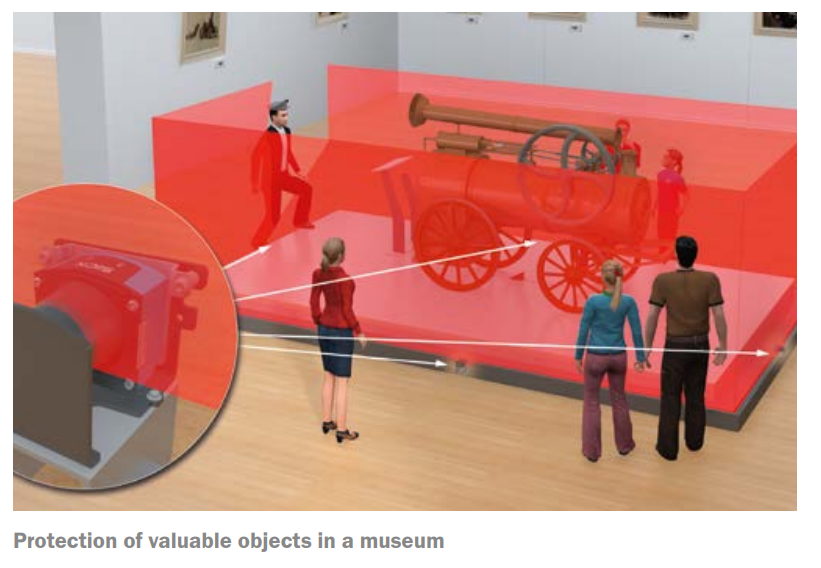
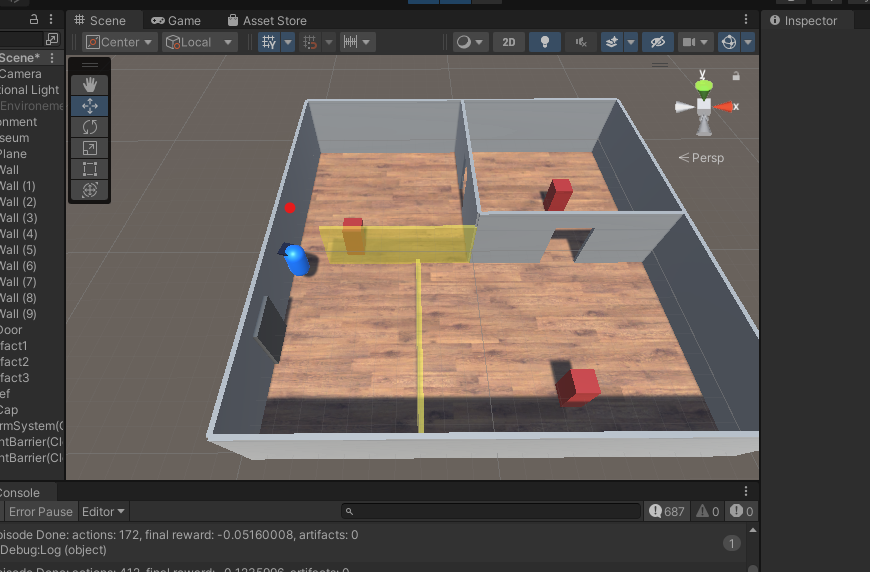

This repository provides a starting point for the SICK Hackathon 2022 Task "Museum Heist" which uses Unity and Reinforcement Learning.

 

  

<h3 align="center">Challenge: Museum-Heist</h3>

  

    Welcome to the SICK Solutions Hackathon! In this challenge your duty is to overcome the security systems of a museum and steal artifacts. This shall be done by simulating an orchestrated assault on the museum, in which a thief tries to gain access to the artifacts witouth being noticed.
  

<!-- TABLE OF CONTENTS -->

Table of Contents

<ol>
  <li>
    <a href="#about-the-project">About The Project</a>
    <ul>
      <li><a href="#built-with">Built With</a></li>
    </ul>
  </li>
  <li>
    <a href="#getting-started">Getting Started</a>
    <ul>
      <li><a href="#prerequisites">Prerequisites</a></li>
      <li><a href="#installation">Installation</a></li>
    </ul>
  </li>
  <li><a href="#usage">Usage</a></li>
  <li><a href="#license">License</a></li>
  <li><a href="#contact">Contact</a></li>
</ol>

<!-- ABOUT THE PROJECT -->
## About The Project
The following scenario takes place in a virtual museum during daytime. The museum is showing a number of artifacts, that are secured with various SICK sensors distributed across the rooms. Your duty will be, to challenge the security concept. This shall be done by simulating an orchestrated assault on the museum, in which an organized group of art thiefs tries to gain access to the artifacts. An artifact is regarded as potentially insecure, if the intruders are able to reach it. The intruders fail, if one or more security alarms are triggered. The task is solved, if a successful strategy for an undetected security area breach for a determined number artifacts is identified.

  

(<a href="#readme-top">back to top</a>)

### Built With:

  
  
  
  

(<a href="#readme-top">back to top</a>)

<!-- GETTING STARTED -->
## Getting Started
In order to participate and to create a solution one needs to setup a development environment. You and your team will need at least one complete setup for testing. In this section you will find some hints how to get started.

### Prerequisites
Essentials:
- Unity Editor
- Python >= 3.7, `poetry` for easy setup.
- This repo

Optional:
- Nvidia GPU, with `nvidia`-driver
- CUDA libray

### Installation
For detail description see the documentation -> [Setup.md](https://gitlab.sickcn.net/Platforms/application-virtualization/thales/thales-examples/museum-heist/-/blob/main/docs/SETUP.md)

If you are facing any issues, please contact us. 

Useful links:
- [How to install Unity](https://learn.unity.com/tutorial/install-the-unity-hub-and-editor)
- [Learn about Unity ML-Agents framework](https://github.com/Unity-Technologies/ml-agents)
- [Python for Windows](https://www.python.org/downloads/windows/)
- [Python dependency and project management with Poetry](https://python-poetry.org/docs/)

(<a href="#readme-top">back to top</a>)

<!-- USAGE EXAMPLES -->
## Usage
This will give you a quick start on how to start a training process. The basic idea of reinforcement learning is shown here:

  

(<a href="source: https://www.kdnuggets.com/2019/10/mathworks-reinforcement-learning.html">
Image source
</a>)

- **Observations** - what the agent perceives about the environment. Observations can be numeric and/or visual.
- **Actions** - what actions the agent can take. Similar to observations, actions can either be continuous or discrete depending on the complexity of the environment and agent.
- **Reward signals** - a scalar value indicating how well the medic is doing. Note that the reward signal need not be provided at every moment, but only when the agent performs an action that is good or bad.

Notes on how to start the training: [Training](https://gitlab.sickcn.net/Platforms/application-virtualization/thales/thales-examples/museum-heist/-/blob/main/docs/TRAINING.md)

<!-- _For more examples, please refer to the [Documentation](https://github.com/Unity-Technologies/ml-agents)_ -->

(<a href="#readme-top">back to top</a>)

<!-- LICENSE -->
## License

Distributed under the MIT License. See `LICENSE.txt` for more information.

(<a href="#readme-top">back to top</a>)

<!-- CONTACT -->
## Contact

- Jonas Grimm - jonas.grimm@sick.de
- Felix Warmuth - felix.warmuth@sick.de

(<a href="#readme-top">back to top</a>)

